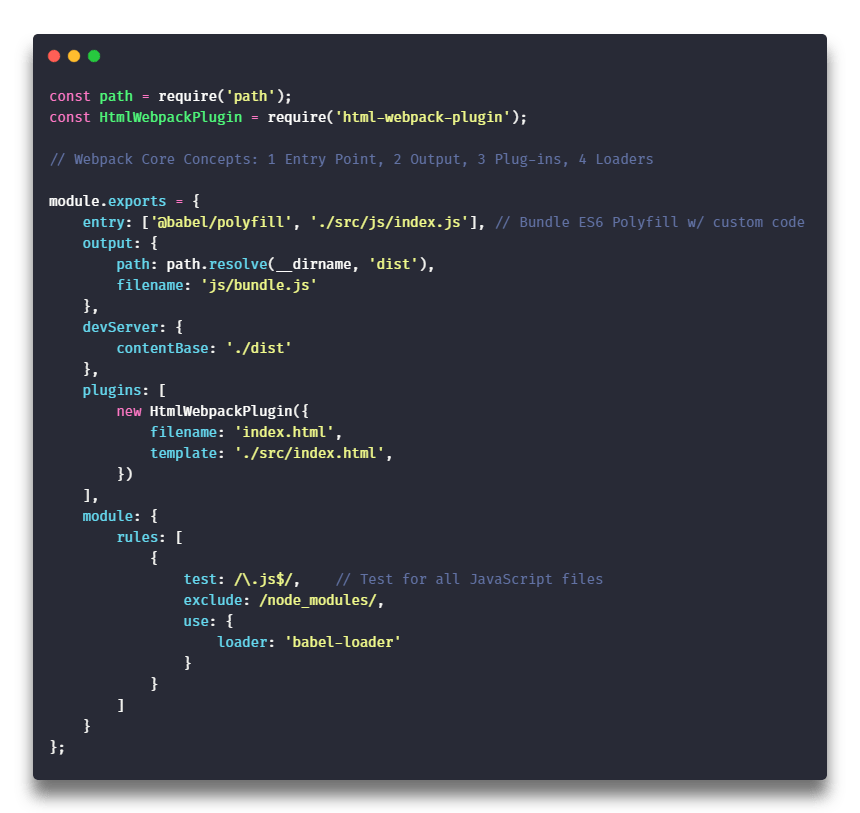

# [Scryfall API App](#) 🗃️

Scryfall API App for starting any project, powered by [javascript, node, express, mongodb, react, redux](#).

##### Try version `1.0.0-beta` using the following [link](#). Thanks!

## To Install

> Before you install, please insure you have the latest version of **Node**, **NPM**, and **Git** installed on your machine.

## Building from sources

```bash
# Clone Repository
git clone https://github.com/cwooz/scryfall-api.git
cd base-config_webpack-babel
# Install app dependencies
npm install
# Run app
npm run start
```

## Built Using

```javascript
import { React, Redux, Node, Express, MongoDB } from 'dependencies';
```


